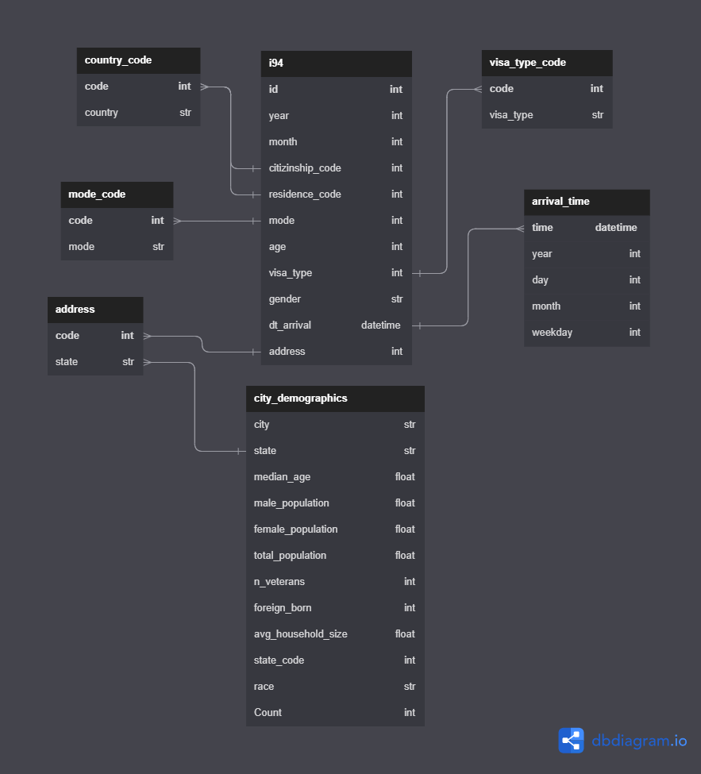

# US Immigration Demographics

Data Engineering Nanodegree Capstone

## Datasets (check Data investigation to understand the data).
- I94 Immigration Data
- U.S. City Demographic Data

## Scope the Project and Gather Data
In this project, I investigated 4 datasets using pandas and chose 2 to be handled and converted into ERD.
Dealing with big data means that I will move my work into scalable technologies so the flow is to:
1. Move the data into S3.
2. Staging the two used tables.
3. ETL data into a star schema.

## Data Model

## Technologies Use:
1. Pandas.
2. PySpark.
3. AWS EMR.
4. AWS S3.